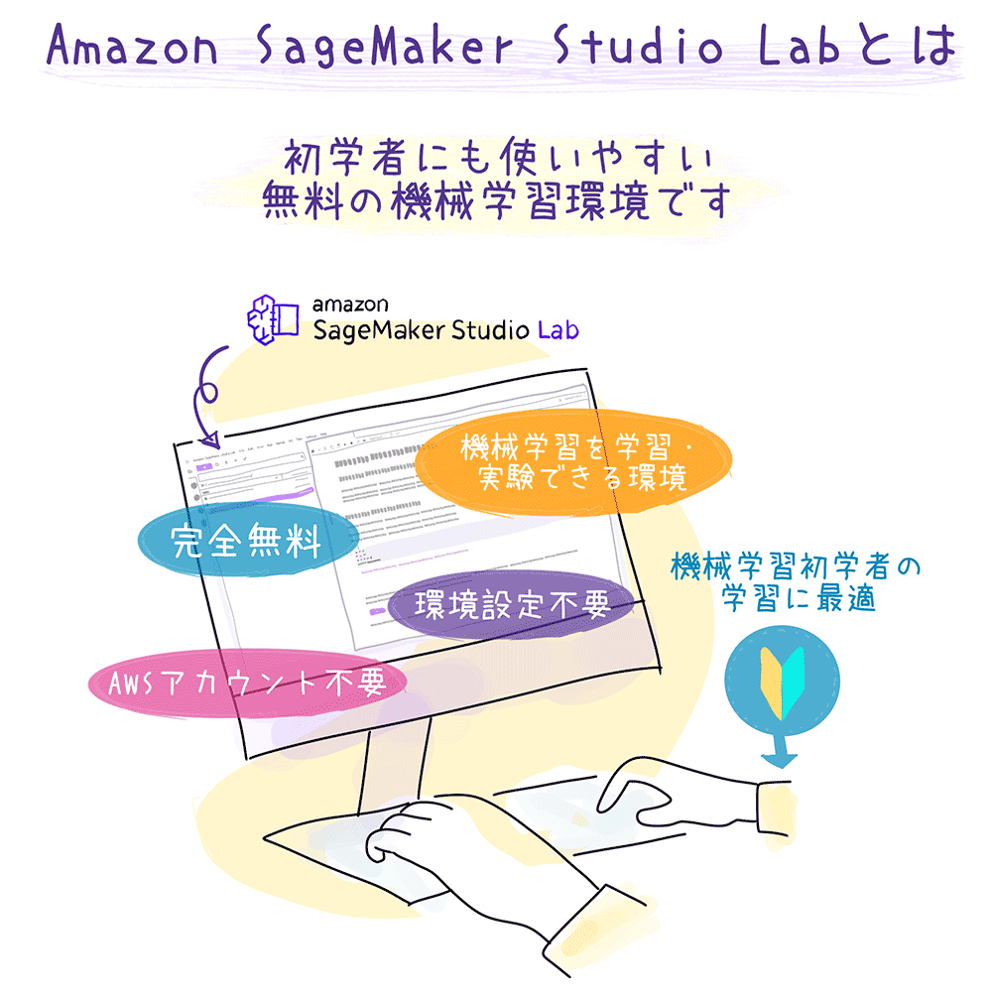
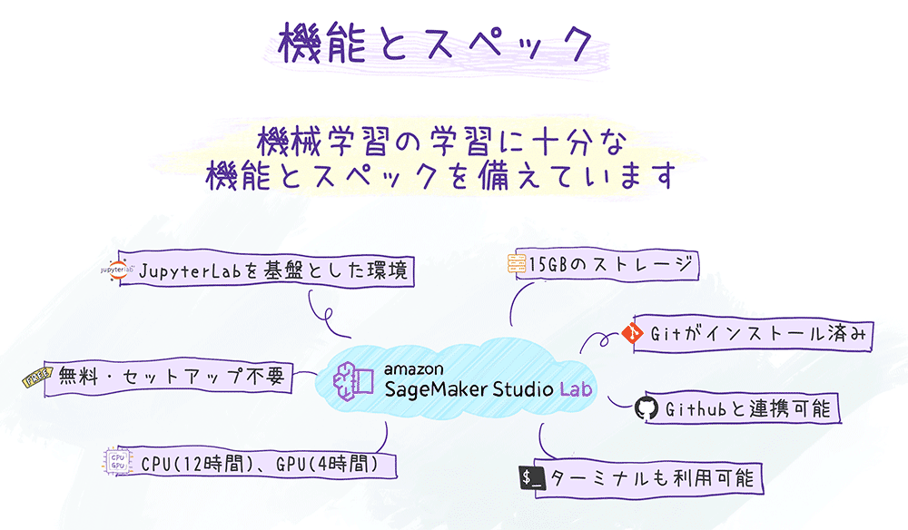
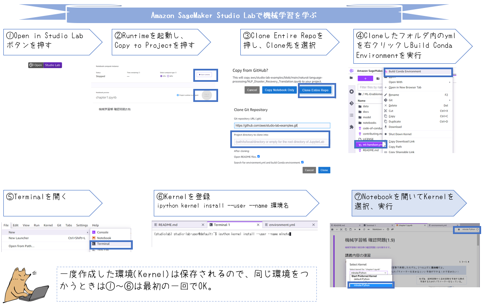
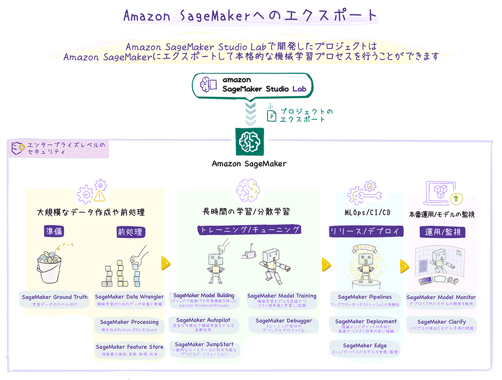

# SageMaker Studio Lab Community

<p align="center">
  
</p>

本リポジトリでは、Amazon SageMaker Studio Labで学べる教材を紹介しています。教材の追加はPull Requestより受け付けておりますので、ガイドラインをご一読の上、[Issues](https://github.com/aws-studiolab-jp/awesome-studio-lab-jp/issues)/[Pull Requests](https://github.com/aws-studiolab-jp/awesome-studio-lab-jp/pulls)よりお送りください。

## Amazon SageMaker Studio Labの使い方

Studio Labはメールアドレスのみでアカウントを登録でき、無料で利用することができます。



アカウントの申し込みは次のフォームから行えます。

<p align="center">
    <a 
     style="background-color:#983eff;border-radius:6px;border:1px solid #c584f3;color:#ffffff;padding:6px 24px;text-decoration:none;"
     href="location.href='https://bit.ly/3kIjuZL'"
    >アカウント作成フォーム
    </a>
</p>

利用方法は[Amazon SageMaker Studio Lab の使い方](./README_usage.md)を参照してください。

## 機械学習を学ぶ教材

Studio LabはJupyterLabと同じように利用でき、Jupyter Notebookで作成されたインタラクティブな機械学習の教材を実行することができます。特に、「Open in Studio Lab」のボタンがあるリポジトリは、ボタンを押すことで簡単にStudio Labで開くことができます。



⑥のカーネルの登録は次のコマンドで行います。このコマンドを実行すると、Notebookを開いたとき右上のボタンからのKernelが選択できるようになります。

```
conda activate 環境名
conda install ipython ipykernel
ipython kernel install --user --name 環境名
```

Open in Studio Labボタンから学べる教材をカテゴリごとに紹介します。

### 機械学習

* [機械学習帳](https://chokkan.github.io/mlnote/index.html)

### 画像処理

* (Comming soon!)

### 自然言語処理

* [BERTによる自然言語処理入門: Transformersを使った実践プログラミング](https://github.com/stockmarkteam/bert-book)
* [Natural Language Processing with Transformers](https://github.com/manuelyhvh/nlp-with-transformers)
* [Hugging Face Quick tour](https://huggingface.co/docs/transformers/quicktour)

### 強化学習

* [ゼロから作るDeep Learning ❹ 強化学習編](https://github.com/oreilly-japan/deep-learning-from-scratch-4)

## 機械学習を活用する教材

機械学習を学ぶ段階から活用する段階になると、機械学習以外の知識も必要になります。アプリケーション開発のプロセスや本番環境で要求される非機能要件を満たすための設計方法などです。

Studio Labは本格的な機械学習アプリケーションを開発するためのSageMakerと統合されており、機械学習の学びから本番環境で稼働させるための開発までシームレスに学ぶことができます。



本セクションでは活用を検討する段階に入ったときに参照する教材を紹介します。

### 機械学習モデル開発基礎

プロダクト開発メンバーの一員として知っておくべき基礎的な知識を学ぶための教材を紹介します。

* [ML Enablement Handson](https://github.com/aws-samples/aws-ml-enablement-handson)

### 機械学習モデル開発実践

分散学習やMLOpsの構築など、本番稼働に欠かせない機械学習モデルの構築技術を学ぶための教材を紹介します。

* (Coming Soon)

## 採用事例

Studio Labを採用頂いている授業や事例を紹介します。

* [4840-1054: Media Computing in Practice (Summer 2022)](https://media-comp.github.io/2022/)


## 関連記事検索

* [Qiita](https://qiita.com/tags/sagemakerstudiolab)
* [Zenn](https://zenn.dev/topics/sagemaker)
* [Twitter](https://twitter.com/search?q=lang%3Aja%20SageMaker%20Studio%20Lab&src=typed_query&f=live)

## リンク

* [aws/studio-lab-examples](https://github.com/aws/studio-lab-examples)
