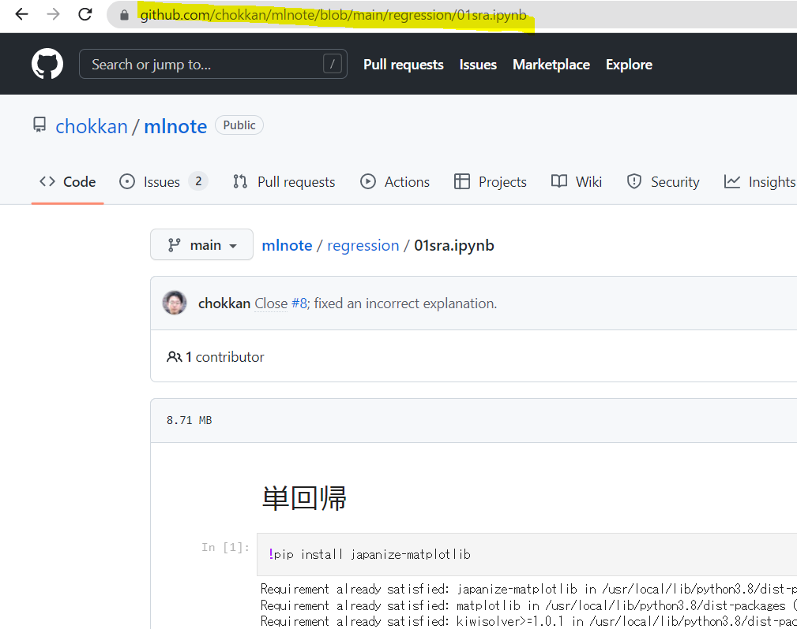
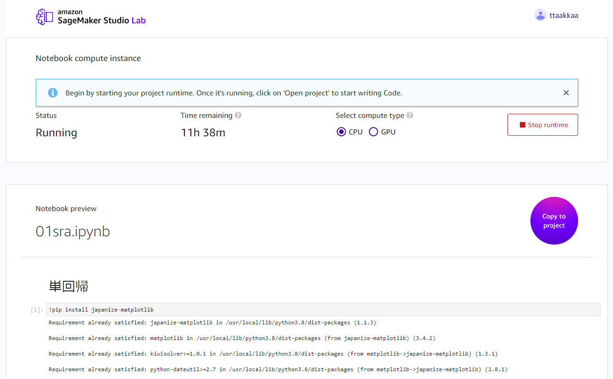

# Open in Studio Lab ボタンの設置方法

GitHubに"Open in Studio Lab"ボタンを設置することで、1 clickでGitHubをStudio Labにインポートすることができるようになります。

(※以下のボタンはサンプルで、押しても何も開きません※)

[](https://studiolab.sagemaker.aws/import/github/<your-org>/<your-repo-name>/blob/<your-branch-name>/<path-to-your-notebook.ipynb>)

## 1. "Open in Studio Lab"ボタンで開きたいJupyter NotebookのURLを確認する。

GitHubでJupyter Notebookを開いたときのURLをコピーします。次の画像は[機械学習帳の例](https://github.com/chokkan/mlnote/blob/main/regression/01sra.ipynb)です。現在Markdownのファイルを開くことはできません。



## 2. "Open in Studio Lab"ボタンのMarkdown記述をコピーする。

"Open in Studio Lab"ボタンを設置したいMarkdownのファイル(README.mdなど)に次の記述をコピーしてください。

```
[](https://studiolab.sagemaker.aws/import/github/<your-org>/<your-repo-name>/blob/<your-branch-name>/<path-to-your-notebook.ipynb>)
```

## 3. "Open in Studio Lab"ボタンのURLを編集する。

コピーしたベース記述の以下のパートを、1で確認したURLの内容をもとに編集します。

* `<your-org>`
* `<your-repo-name>`
* `<your-branch-name>`
* `<path-to-your-notebook.ipynb>`

機械学習帳の例では次のようになります

| パラメータ| 値|
|:---|:---|
|your-org | chokkan|
|your-repo-name|mlnote|
|your-branch-name|main|
|path-to-your-notebook.ipynb|regression/01sra.ipynb|

パラメーターを埋めたボタンは次のようになります(↓のボタンは実際に押せます)。

[](https://studiolab.sagemaker.aws/import/github/chokkan/mlnote/blob/main/regression/01sra.ipynb)

公開する時AWSアカウントへアクセスするためのCredentialなど機微な情報が含まれていないか注意してください。

## "Open in Studio Lab"ボタンを押すとどうなるのか?

ボタンを押すと次のようなプレビュー画面が開きます。**プレビューを開くのにStudio LabのアカウントもAWSアカウントも必要ありません**。プレビューで開いた画面を自分のStudio Labアカウントにコピーしてくるのにアカウントが必要です。コピーしてくる方法は["機械学習を学ぶ教材"をご参照ください](https://github.com/aws-studiolab-jp/awesome-studio-lab-jp#%E6%A9%9F%E6%A2%B0%E5%AD%A6%E7%BF%92%E3%82%92%E5%AD%A6%E3%81%B6%E6%95%99%E6%9D%90)。なお、リポジトリがプライベートである場合はもちろんプレビューを開くのに認証が必要になります。

コピーする対象はNotebook単体、リポジトリ全体いずれも選択できます。複数のNotebookから構成される教材ではリポジトリ全体の方が便利ですが、大きなデータセットが含まれる場合はNotebookのみの方が好ましいかもしれません。Studio Labの静的ストレージは15Gです。


## Studio Labのアカウントを作成するには?

アカウントの申し込みは次のフォームから行えます。

**[アカウント作成フォーム](https://bit.ly/3kIjuZL)**

利用方法は[Amazon SageMaker Studio Lab の使い方](./README_usage.md)を参照してください。
