# Amazon SageMaker Studio Lab の使い方

Amazon SageMaker Studio Labを使い教材を学ぶためのステップを解説します。

1. アカウントを作成する
2. ログインする
3. Jupyter Labを起動する
4. 教材を開く
5. Studio Labをより便利に使う
   * 日本語化する
   * JupyterLabの拡張を導入する
       * Jupyter Notebookでコード補完を行う
       * Jupyter Notebookでコードフォーマットを行う
   * Python以外の言語のKernelを追加する
   * AWSへ接続する
   * データサイエンスのリポジトリを作成する
6. 参考資料 

ハンズオンなどでこの資料を見ている時は、1 から 4 までを実行するとハンズオンで使用するNotebookが開けるはずです。手順の質問をするときは、手順の番号を伝えてください。(例: 1番のアカウント作成の手順3番目のapprovedのメールが届かない・・・など)。 

## 1. アカウントを作成する

1. [アカウント作成フォーム](https://bit.ly/3kIjuZL)からアカウントの申し込みを行う。
   * リファラルコードをお持ちの場合は、アカウント作成フォームで忘れずに入力ください。リファラルコードの詳細は[大規模な講座などでStudio Labのアカウントを発行するにはどうすればよいですか?](https://github.com/aws-sagemaker-jp/awesome-studio-lab-jp/discussions/8)をご参照ください。
   * 
2. `Account request confirmed ...`のメールを受信する。
   * アカウントの申し込みが受け付けられた連絡です。リクエストの受付はすぐにメールが届きます。
3. `Account request approved ...`のメールを受信し、メール内のリンクからアカウントを作成する。
   * 申し込みが承認された連絡です。承認から 7 日以内にメール内のリンクからアカウント作成を行ってください。
   * 承認は 5 営業日以内に結果が通知されます。リファラルコードを利用している場合は 2~3 分以内に結果が届きます。
   * この連絡がなかなか来ない、という場合は[問い合わせフォーム](https://pages.awscloud.com/GLOBAL_PM_PA_amazon-sagemaker_20211116_7014z000000rjq2-registration.html)から連絡してください。
   * リファラルコードを使用してもメールがすぐに届かない場合は、直接 https://studiolab.sagemaker.aws/signup へアクセスしてアカウント登録を試してみてください。
4. `Verify your email ...`のメールを受信し、メール内のリンクからメールアドレスを認証する。
   * アカウント作成後にメールアドレスの認証を行います。メール内のリンクからメールアドレスを認証してください。
5. `Your account is ready ...`のメールを受信する。
   * お待たせしました！利用開始いただけます。

## 2. ログインする

Studio Labへのログインは、[Studio Lab のランディングページ](https://studiolab.sagemaker.aws/)から行います。

1. 右上の "Sign in" ボタンを押す。
   * 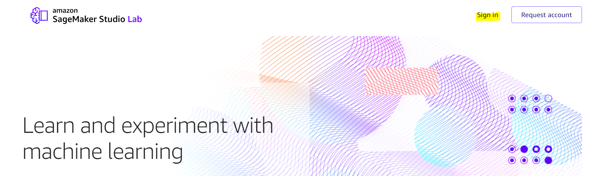
2. Eメールアドレス/ユーザー名、パスワードを入力する。
3. "Sign in" を押しプロジェクトのページを開く。
   * 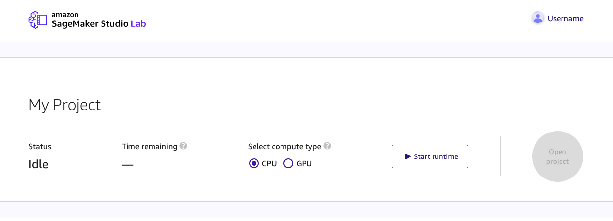

## 3. Jupyter Labを起動する

Studio LabではCPU/GPUのいずれかでJupyter Notebookを実行することができます。CPUは4時間/セッション (1日8時間まで)、GPUは4時間/セッション (1日4時間まで)です。

1. 「My Project」の「Select compute type」から CPUかGPU を選択する。
   * 通常のハンズオンはCPUで十分です。
2. 「Start runtime」を押す。
   * 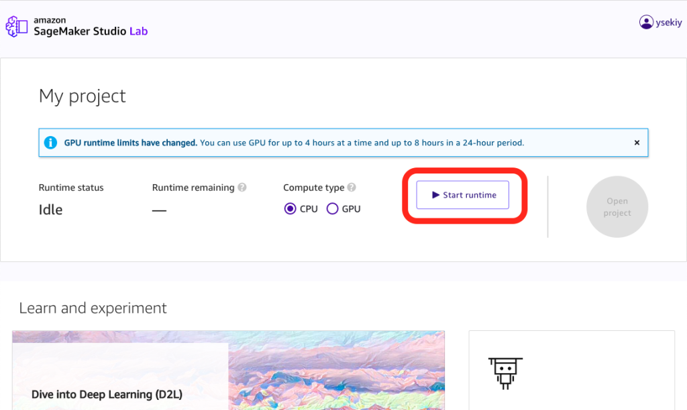
   * 起動時に“There is no runtime available right now.”と表示された場合は何回かボタンを押してみてください。
3. 起動時に多要素認証を求められた場合、使用可能なデバイスで認証を行います。
   * 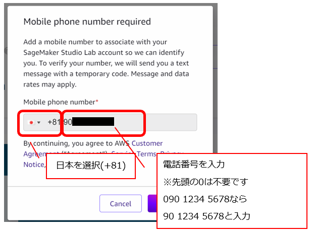
   * 入力した電話番号に届いたコードを入力し認証してください。
4. ランタイムが開始したら「Open project」を押す。
   * JupyterLab 環境が起動します。

## 4. 教材を開く

「Open in Studio Lab」のボタンが付いた教材を開く手順は次の通りです。

1. 教材の「Open Studio Lab」ボタンを押す(※↓のボタンは画像です)。
   * 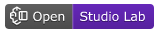
2. 「Copy to Project」を押す。
   * 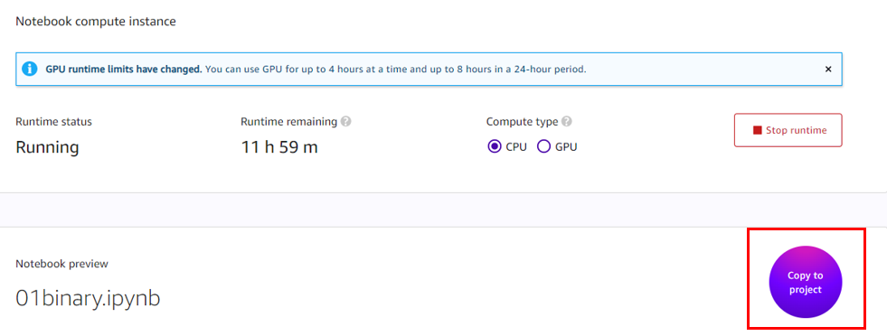
3. 「Clone Entire Repo」 か 「Copy Notebook Only」を押す。
   * Clone Entire Repo は、Studio Labのプロジェクト内に教材をすべてコピーします。Copy Notebook Onlyは開いているノートブックのみコピーします。
   * 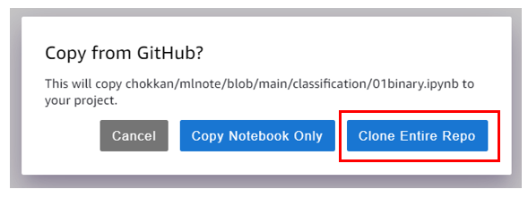
   * 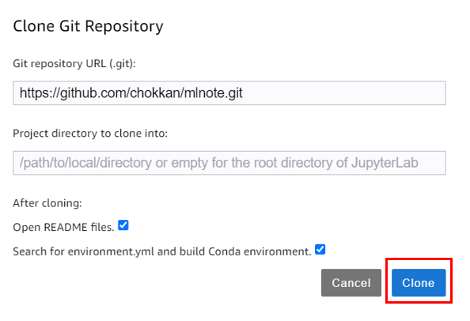
4. "Confirm you want to build..."が出たら「OK」を押す。
   * 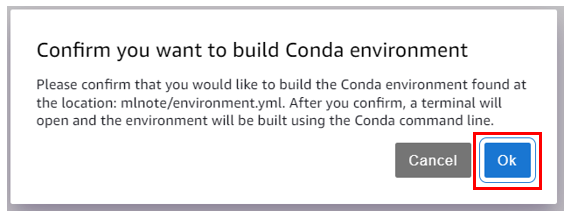
   * OKを押し忘れたら`environment.yml`を右クリックし「Build Conda Environment」を実行してください。
   * `environment.yml`がリポジトリに含まれない場合、このポップアップは登場しません。その際はリポジトリが指定する方法で環境を構築してください。
   * 起動したターミナルで実行されたコマンドが終了したら環境構築は完了です。「done」とコンソール上に表示され、環境を有効化するためのコマンド表示されます。
   * 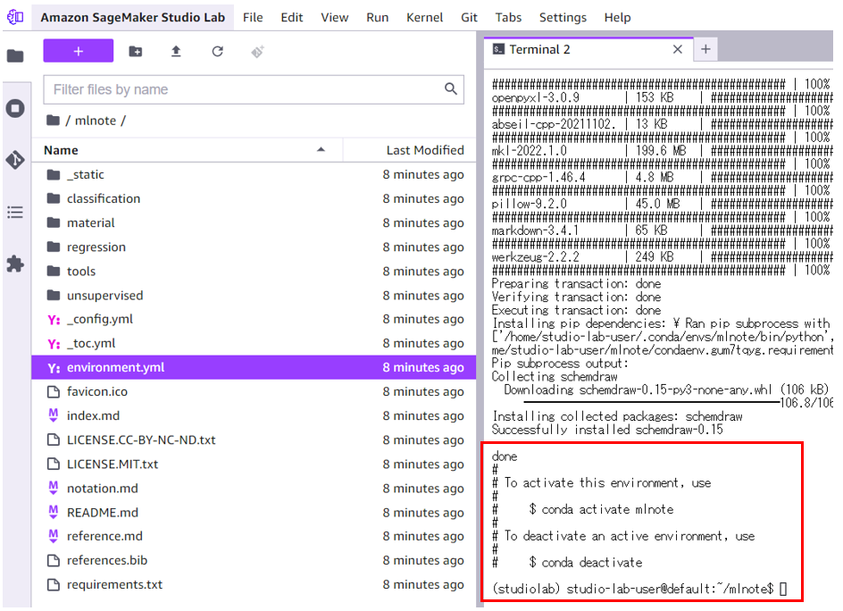
5. 教材のNotebookを開く(ハンズオンの場合、どのNotebookを開くかは講師から指示があるはずです)。
   * Notebookを開いて、右上のメニューから作成したKernelを選択し、作成した環境を選択します。
   * 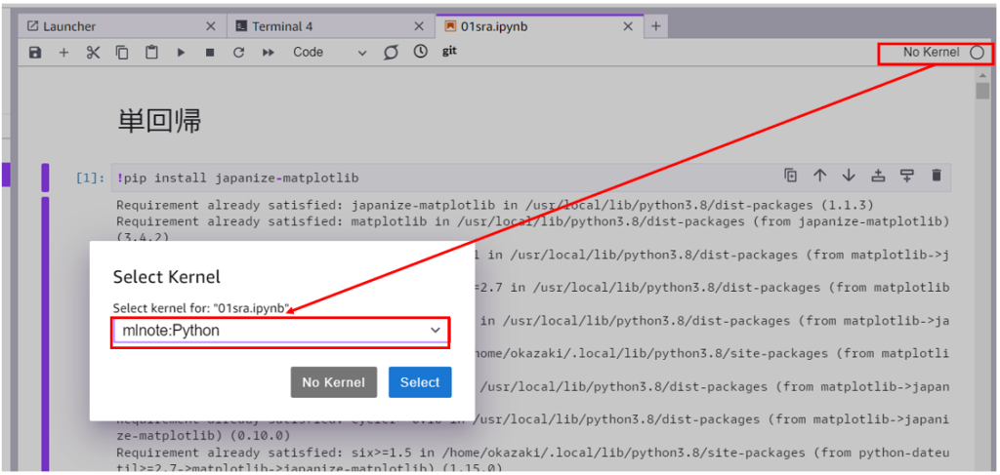

## 5. Studio Labをより便利に使う

### 日本語化する

[JupyterLabの言語パック](https://anaconda.org/search?q=jupyterlab-language-pack)をインストールすることで、部分的に日本語化することができます。

ターミナルを起動し、次のコマンドを実行してください。

```
conda install -c conda-forge jupyterlab-language-pack-ja-jp
```

Settings > Languageから「日本語」が選択できるようになります。

全部日本語にしたいんだよ!!という場合は、次の記事を参考にしてください。

[【AWS Expert Online】SageMaker Studio Lab](https://zenn.dev/shigeru_oda/articles/4d35453eb1a01ffae95c#%E5%88%9D%E6%9C%9F%E7%94%BB%E9%9D%A2)

### JupyterLabの拡張を導入する

JupyterLabの拡張を入れることで開発環境をより便利にカスタマイズできます。拡張を有効にするには、拡張管理のセクションで拡張を"Enable"にしてください。

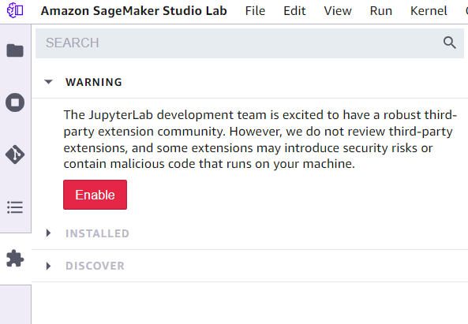

拡張をインストールした後は、JupyterLabを再起動してください。

JupyterLabを再起動します。

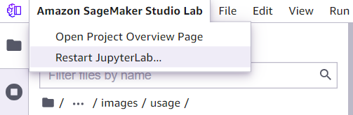

#### Jupyter Notebookでコード補完を行う

[jupyterlab-lsp](https://github.com/jupyter-lsp/jupyterlab-lsp)の拡張を導入することで、Notebookでコード補完が行われるようにできます。

ターミナルを起動し、次のコマンドを実行してください。

```
conda install -c conda-forge nodejs jupyterlab-lsp python-lsp-server
```

JupyterLab再起動後、Notebookでコード補完が効くようになっているはずです。

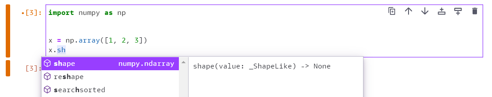


#### Jupyter Notebookでコードフォーマットを行う

[jupyterlab_code_formatter](https://github.com/ryantam626/jupyterlab_code_formatter)を導入することでJupyterNotebook上のコードを成形することができます。`black`と`isort`を使いフォーマットができます。

```
conda install -c conda-forge jupyterlab_code_formatter black isort
```

保存したときに自動的に成形されるようにするには、Settings > Advanced Settings Editor > Jupyterlab Code Formatterから`Auto format config`にチェックを入れてください。

### Python以外の言語のKernelを追加する

JupyterはKernelを追加することで他の言語を動かすことができます。以下はその言語の一覧です。リストにある言語は理論上Studio Labで動かすことができます。

[Jupyter kernels](https://github.com/jupyter/jupyter/wiki/Jupyter-kernels)

各言語の動かし方はQ&Aを参照してください。

* [C++をSageMaker Studio Labで使いたい](https://github.com/aws-sagemaker-jp/awesome-studio-lab-jp/discussions/13)

### AWSへ接続する

Studio Labで用意されているCPUやGPU、ストレージが足りなくなった場合AWSと接続することで移行できます。

* Amazon S3: Amazon S3に接続することで15G以上のストレージが利用可能です。詳細は[Amazon S3 に接続](https://docs.aws.amazon.com/sagemaker/latest/dg/studio-lab-use-external.html#studio-lab-use-external-s3)をご参照ください。
* SageMaker Studio: SageMaker Studioに移行することで、Studio Labと同様の使い勝手でAWS上のGPUインスタンスを利用することができます。詳細は[Amazon SageMaker Studio への移行](https://docs.aws.amazon.com/sagemaker/latest/dg/studio-lab-use-migrate.html) を参照してください。

### データサイエンスのリポジトリを作成する

新しくリポジトリを作成する時は、テンプレートを使うことで品質の高いリポジトリを手早く作成できます。[datascience-template](https://github.com/icoxfog417/datascience-template)はそのうちの一つです。

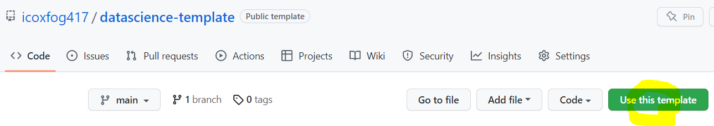

他にも、[Cookiecutter Data Science](https://drivendata.github.io/cookiecutter-data-science/)などプロジェクトのテンプレートを生成してくれるツールがあります。新規にプロジェクトを開始する際は、こうしたベストプラクティスに沿ってリポジトリを作るとよいでしょう。

## 6. 参考資料

* [公式ドキュメント](https://docs.aws.amazon.com/sagemaker/latest/dg/studio-lab.html)
* [公式FAQ](https://studiolab.sagemaker.aws/faq)
* [Studio Lab日本コミュニティQA](https://github.com/aws-sagemaker-jp/awesome-studio-lab-jp/discussions)
   * 使い方に関する質問があればこちらのDiscussionに投稿をお願いします！
