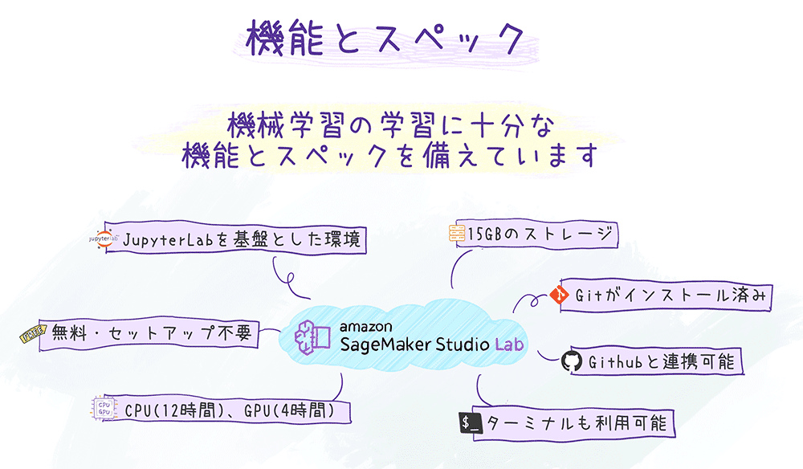

# Amazon SageMaker Studio Lab の使い方

[Amazon SageMaker Studio Lab](https://studiolab.sagemaker.aws/)は無料の機械学習環境です。無料でありつつも、機械学習を学び、価値を検証するのに十分な機能とスペックを備えています。



## アカウントを作成する

はじめにStudio Labのアカウントを作成します。アカウントの申し込みは次のフォームから行えます。

**[アカウント作成フォーム](https://bit.ly/3kIjuZL)**

リファラルコードをお持ちの場合は、アカウント作成フォームで忘れずに入力ください。


アカウントを申し込むと`no-reply@studiolab.sagemaker.aws`から次の順でメールが届きます。

1. `Account request confirmed`
   * アカウントの申し込みが受け付けられた連絡です。5営業日以内に結果が通知されます。
2. `Account request approved`
   * 申し込みが承認された連絡です。承認から7日以内にアカウント作成を行ってください。
3. `Verify your email`
   * アカウント作成後にメールアドレスの認証を行います。
4. `Your account is ready`
   * お待たせしました！利用開始いただけます。

大学の授業などで一括でアカウントを作成したい場合は一括承認用の手立てがあります。詳細は[大規模な講座などでStudio Labのアカウントを発行するにはどうすればよいですか?](https://github.com/aws-sagemaker-jp/awesome-studio-lab-jp/discussions/8)をご参照ください。

## ログインする

Studio Labへのログインは、[Studio Lab のランディングページ](https://studiolab.sagemaker.aws/)から行います。

1. 右上の "Sign in" ボタンを押す。
2. Eメールアドレス/ユーザー名、パスワードを入力する。
3. "Sign in" を押しプロジェクトのページを開きます。

## 教材を開く

Open in Studio Labのボタンが付いた教材を開く手順は次の通りです。


⑥でNotebookにカーネルが表示されない場合があります。表示されない場合、ターミナルを起動して次のコマンドを実行してみてください。

```
conda activate 環境名
conda install ipython ipykernel
ipython kernel install --user --name 環境名
```

## Jupyter Notebookを動かす

Studio LabではCPU/GPUのいずれかでJupyter Notebookを実行することができます。CPUは12時間/セッション、GPUは4時間/セッションです。GPUは24時間以内8時間までという制約があります。

CPU/GPUインスタンスの起動方法は次の通りです。

1. Studio Lab にサインインしたら、このようなプロジェクトページが表示されます。
   * 
1. "My Project" 以下の "Select compute type" から `CPU`か`GPU` を選択します。
1. "Start runtime" を押します。
1. ランタイムが開始したら "Open project" をクリックし JupyterLab 環境を開きます。

インスタンを起動すると、JupyterLab のインターフェイスを拡張したStudio LabのUIが開きます。使い方はJupyterLabと同様で、拡張機能のインストールも可能です。UIになじみのない方は [The JupyterLab Interface](https://jupyterlab.readthedocs.io/en/latest/user/interface.html) のページをご覧ください。


15 GBのストレージが割り当てられるので、ダウンロードしたデータや実行したコード、保存したファイルなどは、後のサインイン時に引き続き利用することができます。

## Studio Labの次のステップへ

Studio Labで用意されているCPUやGPU、ストレージが足りなくなった場合AWSと接続することで移行できます。

* Amazon S3: Amazon S3に接続することで15G以上のストレージが利用可能です。詳細は[Amazon S3 に接続](https://docs.aws.amazon.com/sagemaker/latest/dg/studio-lab-use-external.html#studio-lab-use-external-s3)をご参照ください。
* SageMaker Studio: SageMaker Studioに移行することで、Studio Labと同様の使い勝手でAWS上のGPUインスタンスを利用することができます。詳細は[Amazon SageMaker Studio への移行](https://docs.aws.amazon.com/sagemaker/latest/dg/studio-lab-use-migrate.html) を参照してください。

## リファレンス

* [公式ドキュメント](https://docs.aws.amazon.com/sagemaker/latest/dg/studio-lab.html)
* [FAQ](https://studiolab.sagemaker.aws/faq)
