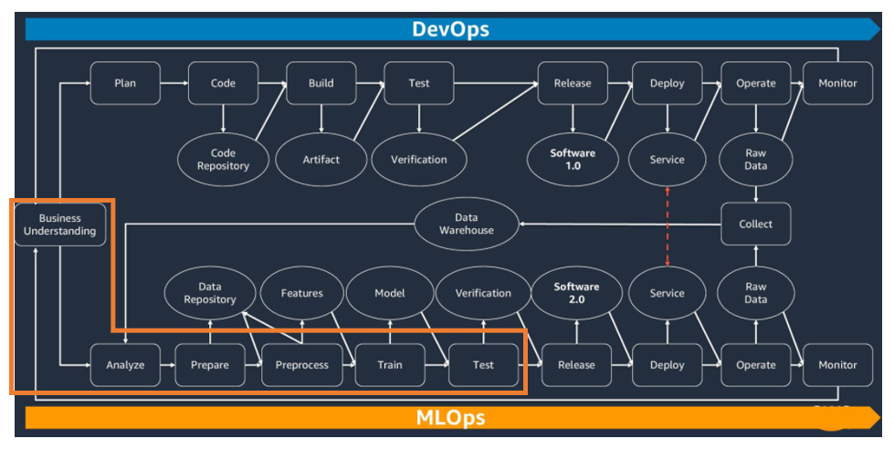
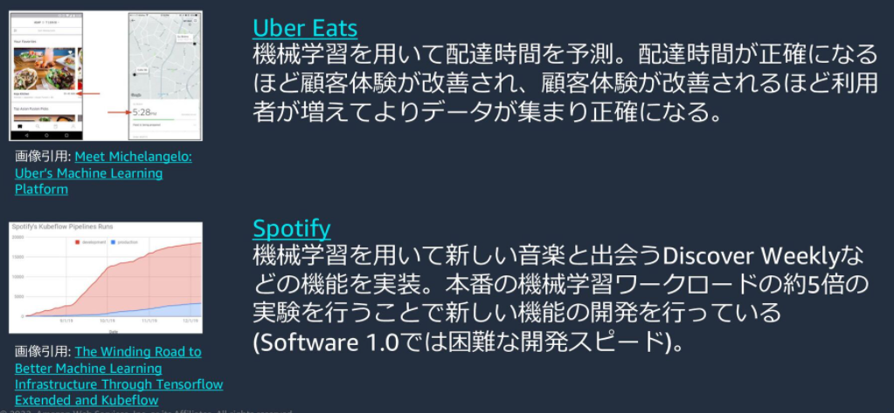
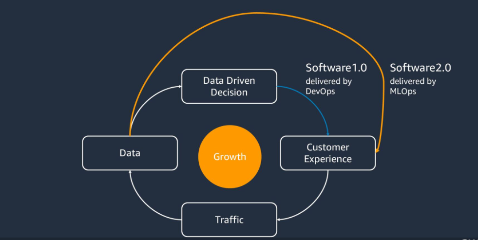
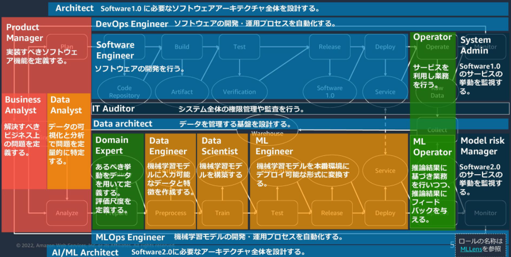

# はじめに

## About this Hands-on

本ハンズオンは、機械学習モデルの開発をビジネス価値につながるよう進めるためのチュートリアルです。要件の確認から運用監視までを10のプロセスで定義し、そのうち「開発」にあたる6つのプロセスを本教材の対象としています。各プロセスの学習時間は10~15分ほどです。

各プロセスはプロセスの概要、機械学習モデルの開発を進めるためのプログラミング演習(Technical Exercise)、他のロールの人に進め方の妥当性を確認するための質問を作成する演習(Communication Exercise)の3つから構成されます。Table of Contentに沿い、自習形式で進めることが可能です。ただ、チームメンバーを巻き込んでCommunication Exerciseを行うことで実際の機械学習モデルの開発がよりスムーズに進められます。

学習のゴールは次の3つです。機械学習モデルの開発を担当するData Scientist以外の方は、3のアクションが取れるようになって頂きたいと思います。

1. Data Scientistとして、機械学習モデルの各開発プロセスでどのような実装が必要かPythonを用いたデモを示せるようになる。
2. Data Scientistとして、機械学習モデルの各開発プロセスで他のステークホルダーにJupyter Notebookを提示しながら必要な確認をとれるようになる。
3. 機械学習モデル開発に関わるステークホルダーとして、機械学習モデルの各開発プロセスでData Scientistに対し適切な声掛け、アドバイスができるようになる。

本ハンズオンでは、TensorFlow/PyTorchでDeep Learningのモデルを構築する方法は扱っていません。ただ、Deep Learningでも機械学習モデルの開発プロセスは変わらないためプロジェクトの進め方として参考になると思います。また、機械学習の理論的な内容は解説していません。実務上より深い知識が求められるようになった場合に備え、各プロセスで参考書籍を記載しているためそちらを参照いただければと思います。

学習環境として、ブラウザベースでJupyter Notebookを作成でき、Gitと統合されているAmazon SageMaker Studio Labを使用しています。

## Why this Hands-on

DevOpsに加え機械学習モデルの開発プロセスであるMLOpsを導入することで、プロダクトに蓄積されるデータをそのまま競争優位性につなげることができます。DevOpsとMLOpsを両立させているプロダクトの例を示しますが、名前を見ただけでどれだけ他の企業の参入が困難であるか感じていただけると思います。それはユーザーが使うほどデータが蓄積され、蓄積されたデータがユーザー体験の向上につながる循環が作れているためです。

Data ScientistだけではMLOpsを構築することはできません。次の図から、多くのロールが実現に関わっていることがわかると思います。本ハンズオンが、プログラミング演習(Technical Exercise)だけでなく、他のロールの人とのコミュニケーションの演習(Communication Exercise)を含んでいるのはこのためです。

## How to proceed this Hands-on

特にコミュニケーションの演習を意義あるものにするために、ありえそうな機械学習プロジェクトのシナリオに沿って演習を進めます。シナリオは次のような設定です。シナリオ中のすべての単語を理解する必要はありません。Communication ExerciseのときにData Scientistに対しどのような情報を提供できるだろう?と考えられるようにするためのインプットです。

* 住宅を販売する会社HouseCompanyで機械学習モデルを開発するプロジェクトが立ち上がり、あなた(Data Scientist)が採用されました。
* HouseCompanyで販売している住宅はウェブサイトに掲示しており、顧客はウェブサイトから問い合わせや注文を行います。ウェブサイトは個別訪問営業よりも幅広いユーザーにアクセスし、見込み顧客を増やすために運用しています。
* ウェブサイト上での参照回数やクリック回数はログに記録され。Data Analystが分析しています。分析結果をもとにBusiness Analystが事業の課題について仮説を立てます。仮説はProduct Managerがウェブサイトの改善を通じ住宅の購入体験をよりよくするためのインプットとなります。
* ウェブサイトはAWS上に構築されています。アプリケーションの開発に使用されている言語はJava、データベースはPostgreSQL(Aurora)です。ソースコードはGitで管理されており、GitHub Actionを通じてコンテナをビルドしECRに登録、Code Deployで承認されるとECSにデプロイされます。ブランチ運用はGitHub Flowを採用しています。セキュリティや障害に関するログはCloudWatchからSlackに連携することで監視しています。ウェブサイトの開発はArchitect、Software Engineer 、DevOps Engineer、運用はSystem Adminにより行われています。
* 掲載している住宅の情報は、販売部門(Operator)がExcelで作成しSoftware Engineerに依頼しバッチ処理で取り込んでもらっています。住宅情報の中でも価格設定は職人的な経験が必要であり、一部のDomain Expertに作業が集中しています。
* ウェブサイト上で公開している住宅の情報は開発ネットワークからアクセス可能ですが、売買契約に関する情報は個人情報保護法などの観点から特定の権限を持ったユーザーが申請を行い特別な端末からしかアクセスできません。セキュリティのルールはIT Auditorが管理しています。データ活用を行うためのデータ基盤は存在しますが、Data Analystから問い合わせがあった場合に都度更新する程度で、定期的なアップデートの仕組みなどは整っていません。専任のData architectはおらず、Architectが兼任しています。
* 機械学習ができる人材はあなたが初めてです。Data EngineerやML Engineer、もちろんMLOps Engineer 、AI/ML architectはまだいません。

Technical Exerciseでは、Jupyter Notebookで機械学習モデルを開発するためのプログラミングコードを動かしながら実装する方法を学びます。
Communication Exerciseでは、「Data Scientistとして、(プロセス名)で(ロール名)に何を聞くべきですか?」といった質問を考えることで他のロールとかかわるための1st Questionを作る方法を学びます。各Communication Exerciseでは質問例を示します。Data Scientist以外のバックグラウンドをお持ちの場合(例えば、Software Engineerの経験があるなど)、ご自身の経験に基づき質問を考えることでData Scientistの方とどのようにCommunicationをとればよいのか示唆が得られると思います。

実際のご自身のロールにとって重要なプロセスを特に学習頂ければと思います。次の表で、ロールとプロセスごとの重要度を3段階で示します(〇、△、なし)。はじめのBuiness Understandingに入る前に、環境設定を行うEnvironment Setupを設けています。

| |(Environment Setup)|Business Understanding|Analyze|Prepare|Preprocess|Train|Test|
|:----|:----|:----|:----|:----|:----|:----|:----|
|Product Manager| |〇|〇|△| | |〇|
|Business Analyst| |〇|〇|△| | |〇|
|Data Analyst| |△|〇|△| | |△|
|Architect |〇|△| | |△|△|△|
|DevOps Engineer|〇| | | | | | |
|Software Engineer| |△| | | | |△|
|Operator| | | | | | | |
|System Admin| | | | | | | |
|IT Auditor|〇| | | | | | |
|Data architect| |△|〇|〇| | |△|
|Domain Expert| |〇|〇|〇| | |〇|
|Data Engineer| | | | |〇|〇| |
|Data Scientist| |〇|〇|〇|〇|〇|〇|
|ML Engineer| | | | | | | |
|ML Operator| | | | | | | |
|Model risk Manager| |△| | | | |△|
|MLOps Engineer| | | | | | | |
|AI/ML Architect| |△| | |△|△|△|

プロセスの説明(横軸)

1. Business Understanding:
   1. ビジネス上発生している問題を機械学習モデルの予測がどのように解決するのか、関係者へのヒアリングを通じ理解しBusiness goalを設定する。
2. Analyze
   1. Business goalを達成するために現状手に入るデータが必要十分であるか、データ分析を行いAnalysis Reportを作成する。
3. Prepare
   1. Analysis Reportをステークホルダーに共有し、必要なデータや不足しているデータの収集や作成を行いDatasetを作成する。
4. Preprocess
   1. Datasetを機械学習モデルが認識しやすい形に変換し、Preprocessed Datasetを作成する。必要に応じデータ同士を組み合わせて新しいデータを作るFeature Engineeringを行う。
5. Train
   1. Preprocessed Datasetを用い、Modelを学習する。
6. Test
   1. Modelが意図した通りに構築されているか、インプット、プロセス、アウトプットの観点から評価しTest Reportを作成する。Test Reportには、Business goalを達成できているかの評価を含める。

ロールの説明(縦軸)
1. Product Manager
   * ユーザー体験を向上させるために実装すべきソフトウェア機能を定義する。
2. Business Analyst
   * 解決すべきビジネス上の問題を定義する。
3. Data Analyst
   * データの可視化と分析で問題を定量的に特定する。
4. Architect 
   * ソフトウェアアーキテクチャ全体を設計する。
5. DevOps Engineer
   * ソフトウェアの開発・運用プロセスを自動化する。
6. Software Engineer
   * ソフトウェアの開発を行う。
7. Operator
   * ソフトウェアを利用し業務を行う。
8. System Admin
   * サービスの挙動を監視する。
9. IT Auditor
   * システムや会社全体の権限管理や監査を行う。
1. Data architect
   * データを管理する基盤を設計、運用する。
1. Domain Expert
   * ドメイン知識を元にあるべき挙動をデータを用いて定義する。評価尺度を定義する。
1. Data Engineer
   * 機械学習モデルに入力可能なデータと特徴を作成する。
1. Data Scientist
   * 機械学習モデルを開発する。
1. ML Engineer
   * 機械学習モデルを本番環境にデプロイ可能な形式に変換する。
1. ML Operator
   * 推論結果に基づき業務を行いつつ、フィードバックを与える。
1. Model risk Manager
   * 機械学習モデルの推論の挙動を監視する。
1. MLOps Engineer
   * 機械学習モデルの開発・運用プロセスを自動化する。
1. AI/ML Architect
   * 機械学習モデル開発に必要なアーキテクチャ全体を設計する。

## Future of Hands-on

本ハンズオンはGitHubで公開しています。本教材を社内での研修やチームの立ち上げにぜひ役立てていただければと思います。改善点などあれば、GitHubのIssueでお知らせいただければと思います。本ハンズオンのコンテンツを皆様の協力を得ながらよりよいものにしたいと考えています。

## Next Step

[Environmental Setup](https://github.com/icoxfog417/ML-Enablement-Handson/blob/main/notebooks/00_environment_setup.ipynb)

## References

1. Takahiro Kubo. [MLOpsのこれまでとこれから](https://speakerdeck.com/icoxfog417/mlopsfalsekoremadetokorekara). 2022.
